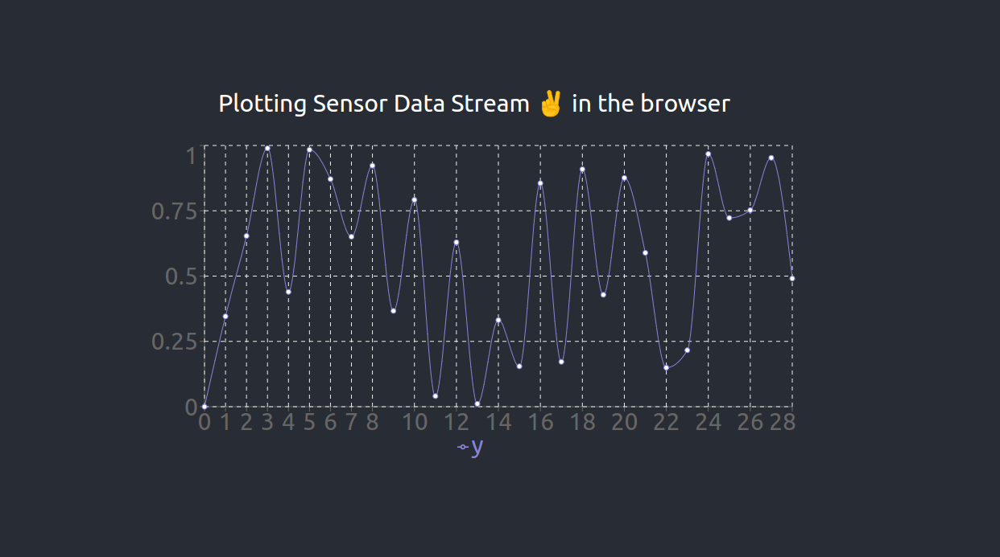

# Plotting Sensor Data Streaming in the Borwser Flask/ React App

## Installation 

~~~bash
$ git clone https://github.com/AbdelrahmanAbounida/stream_sensor_data.git
~~~

### Backend
~~~bash
$ cd backend
$ pip install -r requirements.txt
~~~

### Frontend
~~~bash
$ cd frontend
$ npm i 
~~~

## Running
### Backend
~~~bash
$ cd backend
$ python app.py 
~~~

### Frontend
~~~bash
$ cd frontend
$ npm start
~~~

## Deployment Links

- Backend: 
-- https://stream-sensor.onrender.com/
-- https://stream-sensor.onrender.com/stream

- Frontend: 
-- https://stream-sensor.netlify.app/